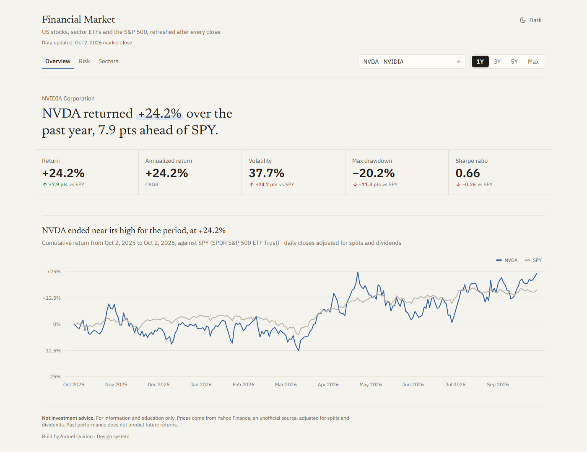
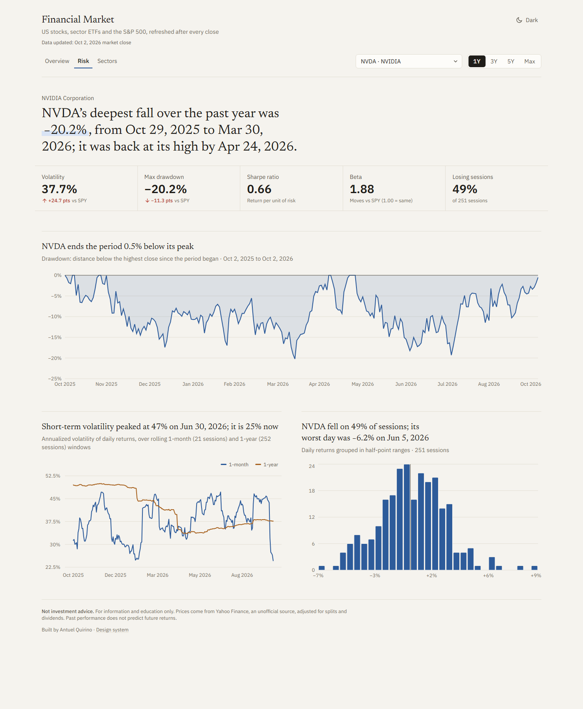
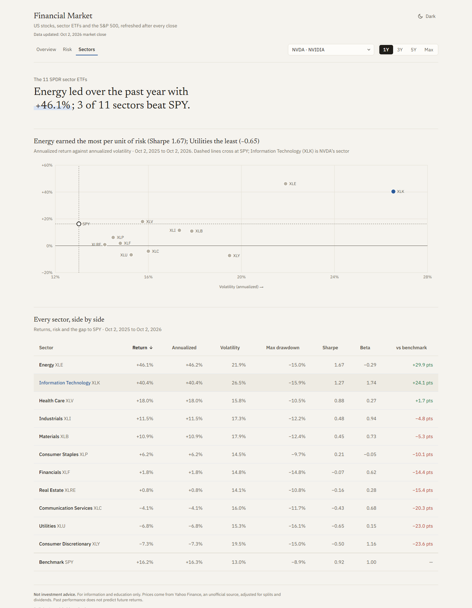
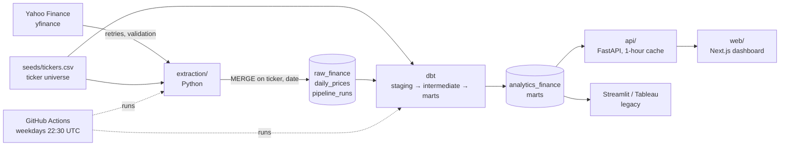

# Financial Market Analysis

[](https://github.com/antuelquirino/Financial-Market-Analysis/actions/workflows/daily_sync.yml)
[](https://github.com/antuelquirino/Financial-Market-Analysis/actions/workflows/tests.yml)

An automated market-data pipeline. Every weekday after the US close it pulls
daily prices for 7 stocks, the 11 SPDR sector ETFs and two benchmarks from
Yahoo Finance, loads them into BigQuery, and computes return and risk metrics
with dbt: cumulative return, CAGR, volatility, drawdown, Sharpe ratio and beta,
over 1, 3 and 5 years. A FastAPI service serves the marts to a Next.js
dashboard.

**Live dashboard: https://financial-market-analysis.vercel.app** ·
[API docs](https://market-api-7cjzbizs7q-uc.a.run.app/docs) ·
[Design system](https://financial-market-analysis.vercel.app/styleguide)

> Not investment advice. The data comes from an unofficial source and is shown
> for educational purposes.

## Dashboard

Three screens share a global ticker and period selector, kept in the URL so
any view can be shared as a link. Each opens with its finding as a sentence,
and every comparison is against SPY over the same dates.

| Overview | Risk | Sectors |
|---|---|---|
|  |  |  |

- **Overview:** return, CAGR, volatility, max drawdown and Sharpe against
  SPY; cumulative return against the benchmark; when the data was last updated.
- **Risk:** the deepest fall with its peak, trough and recovery dates;
  drawdown over time; rolling 1-month and 1-year volatility; the distribution
  of daily returns.
- **Sectors:** the 11 SPDR sector ETFs on a risk-return scatter and in a
  sortable table.

The dashboard reuses InsightFlow's design system ("an analyst's report") with
its own cobalt accent. Its rules and components are documented at
[`/styleguide`](https://financial-market-analysis.vercel.app/styleguide).

### Earlier dashboards

The first versions of the project, kept for reference: Tableau remains a
complement in the portfolio, and the Streamlit app is superseded by the
dashboard above.

- **Streamlit app:** [financial-market-analysis.streamlit.app](https://financial-market-analysis-eebjsbfnfsd57txv6wrgra.streamlit.app/),
  with performance and rolling risk per ticker.
- **Tableau Public:** [Performance vs. Benchmark](https://public.tableau.com/app/profile/antuel.quirino/viz/Perfomancevs_Benchmark/Dashboard1),
  a sector comparison.

## Architecture


```mermaid
flowchart LR
    Y[Yahoo Finance<br/>yfinance] -->|retries, validation| E[extraction/<br/>Python]
    E -->|MERGE on ticker, date| R[(raw_finance<br/>daily_prices<br/>pipeline_runs)]
    S[seeds/tickers.csv<br/>ticker universe] --> E
    S --> D
    R --> D[dbt<br/>staging → intermediate → marts]
    D --> M[(analytics_finance<br/>marts)]
    M --> A[api/<br/>FastAPI, 1-hour cache]
    A --> W[web/<br/>Next.js dashboard]
    M --> ST[Streamlit / Tableau<br/>legacy]
    GA[GitHub Actions<br/>weekdays 22:30 UTC] -. runs .-> E
    GA -. runs .-> D
```

| Layer | What it does |
|---|---|
| **Extraction** (`extraction/`) | Downloads daily OHLCV per ticker, validates it, and upserts it into `raw_finance.daily_prices`. Logs every run to `raw_finance.pipeline_runs`. |
| **Staging** | Typed views over the sources and the ticker seed. |
| **Intermediate** | `int_price_metrics` (daily return, cumulative return, drawdown, rolling volatility and Sharpe) and `int_periods` (1Y/3Y/5Y/MAX windows). |
| **Marts** | `mart_daily_metrics` (time series with the benchmark), `mart_period_series` (series re-based to each period's start), `mart_period_metrics` (headline metrics per ticker and period), `mart_pipeline_status` (data freshness), `dim_tickers` (the ticker list). `mart_prices` is a legacy table for Streamlit and Tableau. |
| **API** (`api/`) | FastAPI over the marts only: fixed SQL with bound parameters, inputs validated with Pydantic, `maximum_bytes_billed` on every query, results cached in memory for an hour, CORS limited to the frontend. |
| **Web** (`web/`) | Next.js (App Router) server components that call the API; the browser never talks to BigQuery or the API directly. |

The ticker universe lives in one file,
[`dbt_project/seeds/tickers.csv`](dbt_project/seeds/tickers.csv). The
extraction reads the same file, so tracking a new ticker is one new row.

### Loading

- **Idempotent.** Each run loads into a scratch table and `MERGE`s into
  `daily_prices` on `(ticker, date)`. Running twice on the same day updates
  rows instead of duplicating them.
- **Incremental.** Each ticker resumes from its last loaded date minus a 10-day
  overlap. A ticker with no history is backfilled from 2021-01-01.
- **Adjusted prices stay consistent.** Yahoo's adjusted close is re-scaled
  back in time every time a dividend or split happens. If the re-downloaded
  overlap does not match what is stored, the ticker is reloaded in full, so its
  whole history is on one adjustment basis.
- **Tolerant of source failures.** yfinance calls are retried with
  exponential backoff (4 attempts). Empty responses, missing columns and
  invalid prices mark only that ticker as failed. The others still load, and
  the failed ticker keeps the history it already had.
- **No partial sessions.** A bar is loaded only after 17:00 New York time on
  its day. Weekends and holidays need no special case, because Yahoo has no
  bar for them.
- **Cheap to query.** Raw data and marts are partitioned by month on `date`
  and clustered by `ticker`, and every dbt query is capped by
  `maximum_bytes_billed`.

The marts are rebuilt in full each run instead of incrementally. They hold
~29k rows, and rolling windows combined with re-based adjusted prices make
incremental models error-prone for no measurable saving.

## Financial assumptions

Every assumption is a dbt var in
[`dbt_project.yml`](dbt_project/dbt_project.yml), used through
[`macros/finance.sql`](dbt_project/macros/finance.sql).

| Assumption | Value | Used in |
|---|---|---|
| Prices | Close adjusted for splits and dividends (`adj_close`) | All returns |
| Risk-free rate | 4% a year, constant (~3-month T-bill); daily = 4% / 252 | Sharpe ratio |
| Annualization | 252 trading sessions a year | Volatility, Sharpe |
| Rolling windows | 21 sessions (~1 month) and 252 sessions (~1 year); null until full | Rolling volatility and Sharpe |
| Benchmark | SPY (total return, like the adjusted stock prices; ^GSPC excludes dividends) | Benchmark return, excess return, beta |
| Periods | 1Y, 3Y, 5Y back from the latest benchmark session, plus MAX | Period metrics |

| Metric | Definition |
|---|---|
| Daily return | `adj_close_t / adj_close_t-1 − 1` |
| Cumulative / total return | `adj_close_t / adj_close_start − 1` |
| CAGR | `(1 + total return) ^ (365.25 / calendar days) − 1` |
| Volatility | `std(daily returns) × √252` |
| Drawdown | `adj_close_t / max(adj_close up to t) − 1`; max drawdown is its minimum |
| Sharpe ratio | `(mean daily return − 4%/252) / std(daily returns) × √252` |
| Beta | `cov(r, r_benchmark) / var(r_benchmark)` on daily returns |

Within a period, the first session's return is excluded, because it belongs to
the day before the period starts. A dbt unit test checks returns, cumulative
return and drawdown on a hand-computed series.

## Automation

[`daily_sync.yml`](.github/workflows/daily_sync.yml) runs at **22:30 UTC,
Monday to Friday**. That is 1.5 to 2.5 hours after the US close, depending on
daylight saving time.

1. Authenticates to Google Cloud with **Workload Identity Federation**. No
   service-account key is stored in GitHub: the workflow exchanges a
   short-lived OIDC token for credentials limited to the pipeline's datasets.
2. Runs the extraction (`python -m extraction.pipeline`).
3. Runs `dbt build` (seeds, models and tests in dependency order) and
   `dbt source freshness`.
4. Fails the job if any ticker failed, after building what did load. The job
   summary lists the failed tickers and the reason for each.

Safeguards:

- A `concurrency` group keeps runs from overlapping.
- Failed scheduled runs trigger GitHub's email notification.
- `mart_pipeline_status` records the latest market session and the last
  successful run, for the dashboard's "Data updated" indicator.
- GitHub disables scheduled workflows after 60 days without commits in a
  public repository. A `keepalive` job re-enables the workflow through the API
  on every run to prevent that.

[`tests.yml`](.github/workflows/tests.yml) runs pytest and `dbt parse`, and
lints, type-checks, tests and builds the frontend, on every push to `main` and
every pull request.

## API

Interactive docs at `/docs` when the API is running.

| Endpoint | Returns | Reads |
|---|---|---|
| `GET /health` | `ok` (no BigQuery call) | — |
| `GET /status` | Latest market session, last successful run, tickers up to date | `mart_pipeline_status` |
| `GET /tickers` | Tickers with type, sector and history range | `dim_tickers` |
| `GET /performance/{ticker}?period=1Y` | Period metrics and cumulative return against SPY | `mart_period_metrics`, `mart_period_series` |
| `GET /risk/{ticker}?period=1Y` | Period metrics, drawdown series, rolling volatility, distribution of daily returns | `mart_period_metrics`, `mart_period_series`, `mart_daily_metrics` |
| `GET /sectors?period=1Y` | The 11 sector ETFs and SPY over the period | `mart_period_metrics` |

`period` is one of `1Y`, `3Y`, `5Y`, `MAX`. An unknown ticker is a 404, an
invalid period a 422, and a BigQuery failure a 502 without internal details.

## Deploy

| Piece | Where | How it updates |
|---|---|---|
| Dashboard | [Vercel](https://financial-market-analysis.vercel.app) (root `web/`) | Every push to `main` |
| API | [Cloud Run](https://market-api-7cjzbizs7q-uc.a.run.app/docs), us-central1, 0–2 instances | [`deploy-api.yml`](.github/workflows/deploy-api.yml): on pushes to `main` that touch the API, tests → image → deploy, through Workload Identity Federation |
| Data | BigQuery, US | [`daily_sync.yml`](.github/workflows/daily_sync.yml), weekdays after the close |

The API runs as a read-only service account, scales to zero, and the project
has a US$5 budget with alerts. [`docs/deploy.md`](docs/deploy.md) has the
whole setup as a reusable recipe.

## Run it from scratch

Requirements: Python 3.11, the Google Cloud CLI, and a Google Cloud project with
BigQuery and billing enabled. Without billing, BigQuery's sandbox deletes tables
after 60 days.

```bash
pip install -r requirements-dev.txt
gcloud auth application-default login          # local credentials for BigQuery

# Datasets (once), in the US multi-region
bq mk --location=US --dataset financial-market-analysis:raw_finance
bq mk --location=US --dataset financial-market-analysis:analytics_finance

python -m extraction.pipeline                  # first run backfills from 2021
cd dbt_project && dbt deps && dbt build        # models + tests
dbt source freshness

pytest                                         # extraction and API tests, no network needed

# API on port 8765 (Windows reserves 8000 on some machines)
uvicorn api.main:app --reload --port 8765

# Dashboard on http://localhost:3000 (Node 24)
cd web && cp .env.example .env.local && npm install && npm run dev
```

Use another project with `GCP_PROJECT=<project-id>`. Reload all history with
`python -m extraction.pipeline --full-refresh`.

[`docs/setup-gcp.md`](docs/setup-gcp.md) covers the one-time Google Cloud setup
for GitHub Actions: the service account, Workload Identity Federation and the
repository variables.

## Tech stack

| Layer | Technology |
|---|---|
| Extraction | Python, yfinance, pandas |
| Warehouse | Google BigQuery (US) |
| Transformation | dbt Core + dbt-bigquery, dbt_utils |
| Orchestration | GitHub Actions + Workload Identity Federation |
| API | FastAPI, Pydantic |
| Frontend | Next.js 16, React 19, Tailwind CSS 4, Recharts, Tremor Raw components |
| Testing | pytest, dbt data and unit tests, Vitest |
| Legacy visualization | Streamlit, Tableau Public |

---

**Author:** Antuel Quirino
